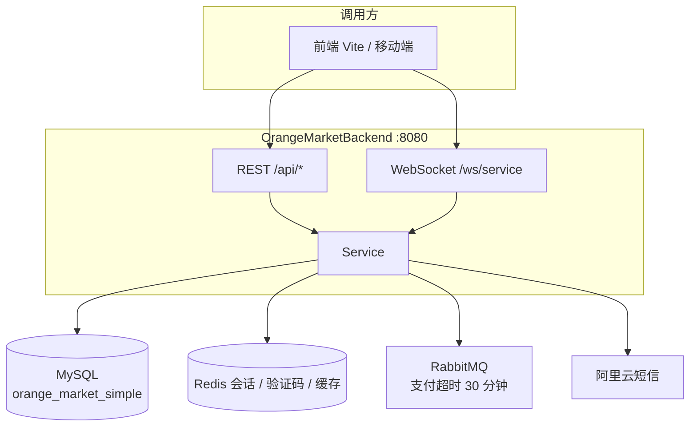

<p align="center">
  
</p>

<h1 align="center">橙子市集 · 后端</h1>

<p align="center"><strong>OrangeMarketBackend</strong></p>

<p align="center">
  为橙子市集提供 REST + WebSocket 的电商后端：登录、商品、订单、客服、管理端都在这里
</p>

<p align="center">
  
  
  
  
</p>

<p align="center">
  <a href="https://github.com/CzlRx/OrangeMarketFrontend">前端仓库</a>
  ·
  <a href="#快速开始">快速开始</a>
  ·
  <a href="#接口一览">接口一览</a>
</p>

---

这是橙子市集的服务端。C 端从浏览到支付、收货、评价走完整交易链；客服用 Redis 管在线、用 WebSocket 推消息；未支付订单靠 RabbitMQ 延迟队列在 30 分钟后自动取消。鉴权是 **JWT + Redis 会话**，无 Cookie、无 Shiro Session。

配套前端：[OrangeMarketFrontend](https://github.com/CzlRx/OrangeMarketFrontend)。

## 架构



| 组件 | 用途 |
|------|------|
| Spring Boot 4.1 / Java 21 | WebMVC + WebSocket |
| MyBatis-Plus 3.5 | 表映射、逻辑删除 `deletedAt` |
| Shiro 3 + JJWT | 无状态过滤器校验 Bearer Token |
| Redis | 登录会话、图形验证码、短信频控、商品列表短缓存 |
| RabbitMQ | 下单后投入延迟队列，超时取消未支付订单 |
| Kaptcha | 登录前图形验证码 |
| 阿里云号码认证 | 短信验证码发送与校验 |

主类排除了 Shiro 自动配置，改走自定义 `ShiroConfig` / `StatelessAuthFilter`。

## 模块

| 模块 | 表 / 能力 |
|------|-----------|
| 账号 | `user_account`：手机号登录，未注册自动开户 |
| 商品 | `product_category` / `product` / `product_review` |
| 购物车 | `cart_item`，支持游客车合并 |
| 地址 | `user_address` |
| 订单 | `orders` / `order_item`：预览、下单、模拟支付、取消、收货 |
| 足迹 | 收藏、浏览历史、搜索历史 |
| 客服 | `service_session` / `service_message` + `/ws/service` |
| 管理 | 发货、封禁用户；客服大厅抢单（角色 `admin` / `ADMIN`） |

秒杀、售后、退款等枚举已预留，主流程尚未接入。

## 鉴权

```text
GET  /api/auth/captcha     图形码写入 Redis，5 分钟
POST /api/auth/sms/send    校验图形码 → 阿里云发短信，60 秒频控
POST /api/auth/login       校验短信 → 写 Redis 会话 → 签发 JWT（24h）
后续请求                   Authorization: Bearer {jwt}
DELETE /api/auth/logout    删 Redis 会话
```

JWT 的 `subject` 是 `sessionId`，claims 带 `userId` / `phone`。过滤器除了验签，还要求 Redis 里会话仍在，登出立即失效。

公开接口：验证码、登录、分类、商品、商品评价、WebSocket 握手路径。`/ws/service` 对 Shiro 匿名，JWT 在握手拦截器里校验（query `token` 或 `Authorization`）。

统一响应：

```json
{
  "code": 0,
  "message": "success",
  "data": {},
  "timestamp": 1710000000000
}
```

`code === 0` 成功。常见错误码：`40000` 参数、`40100` 未登录、`40300` 无权限、`40900` 库存不足。完整契约见 [API_DOCUMENTATION.md](./API_DOCUMENTATION.md)（客服章节若文档仍写「未设计」，以本仓库代码为准）。

### 订单状态

```text
pending_payment ──支付──► pending_shipment ──发货──► pending_receipt
        │                                              │
        └──超时/取消                                    └──收货──► pending_review ──评价──► completed
```

支付目前为 `mock`。延迟消息 TTL 为 30 分钟（`RabbitConfig.PAYMENT_TIMEOUT_MILLIS`）。

## 接口一览

Base path：`http://localhost:8080`

| 前缀 | 说明 |
|------|------|
| `/api/auth` | 验证码、短信、登录、登出、当前用户 |
| `/api/categories` | 分类 |
| `/api/products` | 列表、详情、评价 |
| `/api/cart` | 购物车 CRUD 与合并 |
| `/api/users/me` | 资料、地址、收藏、足迹、搜索历史 |
| `/api/orders` | 预览、下单、支付、取消、收货 |
| `/api/users/me/reviews/pending` | 待评价 |
| `/api/orders/{id}/reviews` | 提交评价 |
| `/api/service` | 用户客服会话 |
| `/api/admin` | 发货、封禁 |
| `/api/admin/service` | 客服大厅、接单、关闭 |
| `/ws/service?token=` | 客服实时通道 |

WebSocket 消息 `type`：`ping` / `pong` / `chat` / `connected` / `session_claimed` / `session_closed` / `error`。

## 快速开始

依赖：**Java 21**、**MySQL 8**、**Redis**、**RabbitMQ**。短信登录还需要阿里云密钥，否则发码/校验会失败。

### 1. 建库

```bash
mysql -u root -p < sql/01_init.sql
mysql -u root -p orange_market_simple < sql/create_service_tables.sql
```

`01_init.sql` 会创建库 `orange_market_simple`、核心业务表和演示数据。客服两张表在 `create_service_tables.sql`，需要额外执行。

演示账号（执行初始化后可用）：

| 手机号 | 角色 |
|--------|------|
| `13800138001` | 普通用户「橙子同学」 |
| `13800138002` | 普通用户「小橙子」 |
| `13800138003` | 普通用户「阳光用户」 |

管理员没有独立登录接口：在 `user_account` 把对应用户的 `role` 改为 `ADMIN` 即可。

### 2. 中间件

默认连接（均可被环境变量覆盖）：

| 服务 | 默认 |
|------|------|
| MySQL | `localhost:3306` / 库 `orange_market_simple` / `root` / `123456` |
| Redis | `localhost:6379`，无密码 |
| RabbitMQ | `localhost:5672` / 用户 `czlr` / 密码 `123456` / vhost `/` |

### 3. 启动

```bash
git clone https://github.com/CzlRx/OrangeMarketBackend.git
cd OrangeMarketBackend
./mvnw spring-boot:run
```

或：

```bash
./mvnw -DskipTests package
java -jar target/OrangeMarketBackend-0.0.1-SNAPSHOT.jar
```

起来后：`http://localhost:8080`。前端开发服务器应指向该地址（Vite 已代理 `/api` 与 `/ws`）。

## 环境变量

| 变量 | 含义 | 默认 |
|------|------|------|
| `MYSQL_HOST` | 数据库主机 | `localhost` |
| `MYSQL_DATABASE` | 库名 | `orange_market_simple` |
| `MYSQL_USERNAME` / `MYSQL_PASSWORD` | 账号 | `root` / `123456` |
| `REDIS_HOST` / `REDIS_PORT` / `REDIS_PASSWORD` | Redis | `localhost` / `6379` / 空 |
| `RABBITMQ_HOST` / `RABBITMQ_PORT` | 队列 | `localhost` / `5672` |
| `RABBITMQ_USERNAME` / `RABBITMQ_PASSWORD` | 队列账号 | `czlr` / `123456` |
| `RABBITMQ_VIRTUAL_HOST` | 虚拟主机 | `/` |
| `ALIYUN_SMS_ACCESS_KEY_ID` | 短信 AK | 空 |
| `ALIYUN_SMS_ACCESS_KEY_SECRET` | 短信 SK | 空 |
| `ALIYUN_SMS_SIGN_NAME` | 短信签名 | `恒创联众` |
| `ALIYUN_SMS_TEMPLATE_CODE` | 模板 | `100001` |

JWT 密钥与过期时间在 `application.yaml` 的 `jwt.*`。仓库里的默认值只适合本地，上线务必更换。

## 目录

```text
src/main/java/com/czlr/orangemarketbackend/
├── controller/     Auth / Product / Cart / Order / User / Review / Service / Admin
├── service/        业务与短信
├── mapper/         MyBatis-Plus
├── entity/po|dto   表实体与请求响应
├── config/         Shiro、Redis、RabbitMQ、WebSocket、Kaptcha
├── websocket/      客服握手与消息
├── consumer/       订单超时取消
└── common/         Result、错误码、枚举
sql/
├── 01_init.sql                 建库 + 核心表 + 演示数据
└── create_service_tables.sql   客服会话与消息
```

## 相关仓库

| 仓库 | 角色 |
|------|------|
| [OrangeMarketBackend](https://github.com/CzlRx/OrangeMarketBackend) | 本仓库 |
| [OrangeMarketFrontend](https://github.com/CzlRx/OrangeMarketFrontend) | React 用户端与管理端 |
